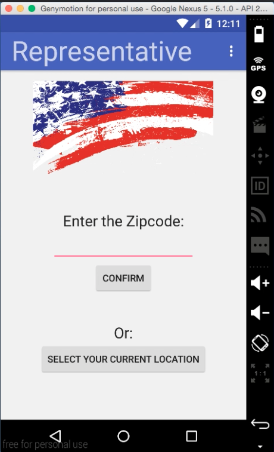
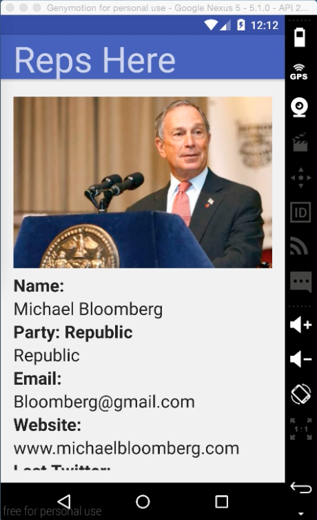
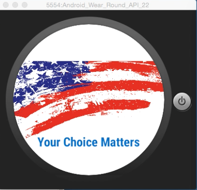
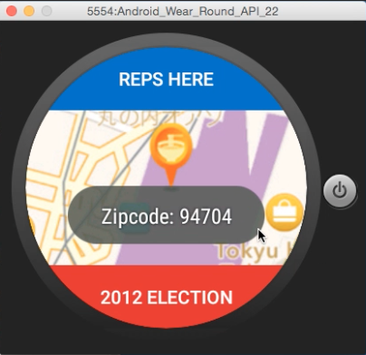
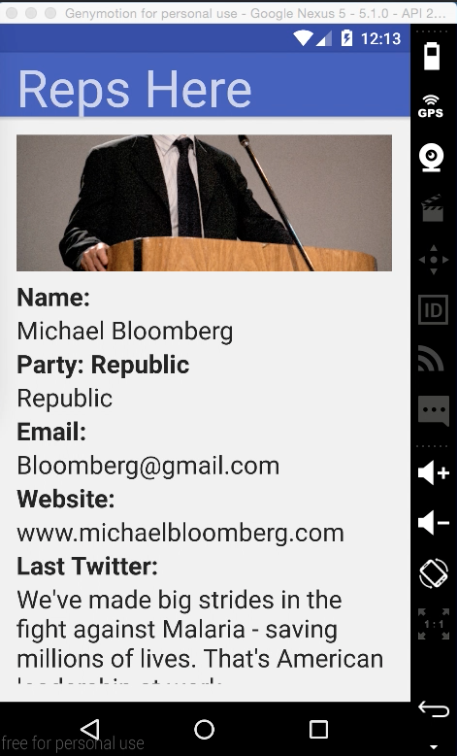
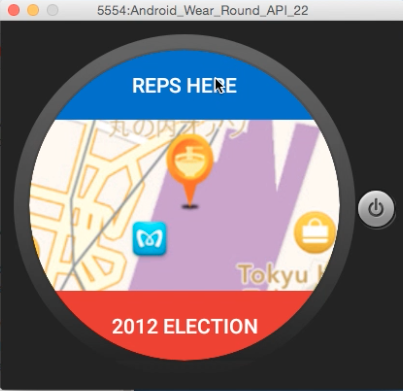
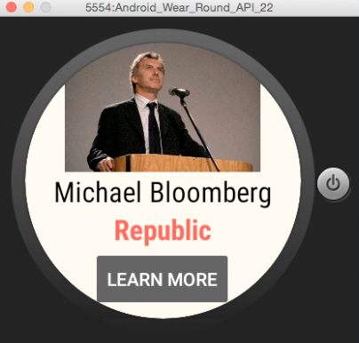
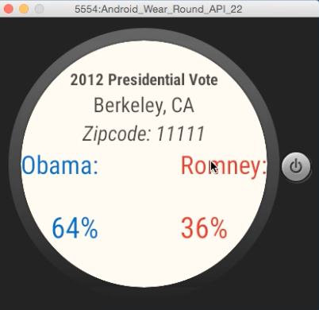

# PROG 02: Represent!

An app that can allow user to see the info about eletion in both smartphones and smartwatches.

## Authors

Qingyu Wang ([qywang@berkeley.edu](mailto:your_email@berkeley.edu))

## Demo Video

See [Video Demo Representative] (https://www.youtube.com/watch?v=Rtc2MXUsaOQ)

## Screenshots

## Acknowledgments

* Hat tip to anyone who's code was used
* Any other support
